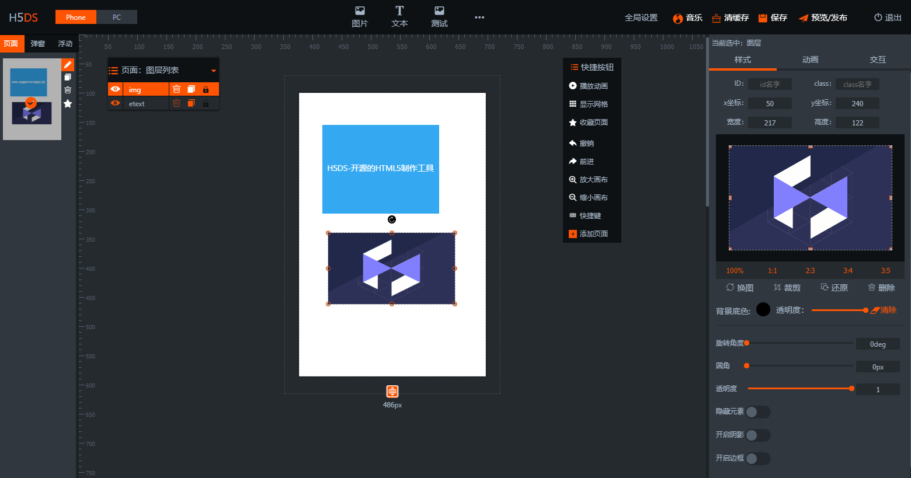

# **简介**

- H5DS (HTML5 Design software) 这是一款基于WEB的 H5制作工具。让不会写代码的人也能轻松快速上手制作H5页面。
- H5DS 官方 Git (https://github.com/h5ds/h5ds) ，简体中文 UTF8 版本，其他版本请自行转码
- h5ds 官方站：http://www.h5ds.com

# **版权声明**

您可以下载本站代码，但未经许可 **禁止** 在本产品的整体或任何部分基础上以发展任何派生版本、修改版本或第三方版本用于 **重新分发** ,您可以下载源码进行学习或者个人开发者在自己电脑上搭建使用而无需支付任何费用，非授权用户不可去掉编辑器的LOGO和官方链接地址，任何企业或者个人在未获得四川爱趣五科技有限公司的书面授权之前，不能将该工具用于任何商业行为，您若有违反规定，四川爱趣五科技有限公司有权随时中止或终止您对H5DS产品的使用资格并保留追究相关法律责任的权利

# **相关网站**

- h5ds 官方站：http://www.h5ds.com

# **技术交流群**

[QQ群 549856478](https://jq.qq.com/?_wv=1027&k=5I0kPBX)

# **友情提示**

若有BUG，请及时issues我们，会第一时间做修改！

# **安装使用说明**

运行环境 node v6.x npm 5.x

1. 执行 `npm i` 安装所需依赖包，如果安装失败，请尝试cnpm安装，具体cnpm使用方法请自行谷歌
2. 执行 `npm start` 来启动 h5ds 服务
3. 浏览器输入：http://localhost:8080 即可访问
4. 在全局设置里面查看帮助说明，制作页面，点击发布 -> F12打开调试面板，可以查看生成后的HTML代码。复制粘贴出来保存成HTML文件即可打开访问！

# **更新说明**

请查看 CHANGELOG.md 文件
